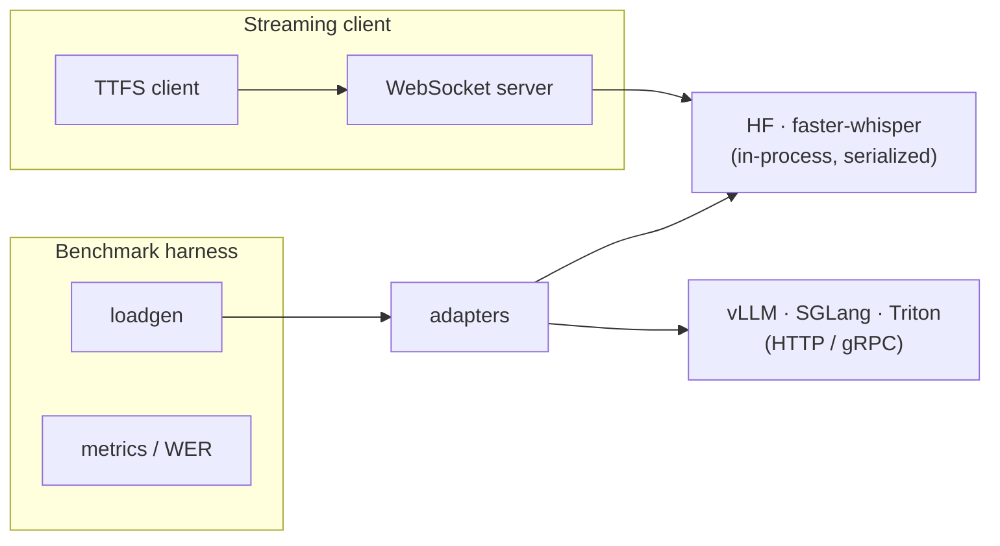
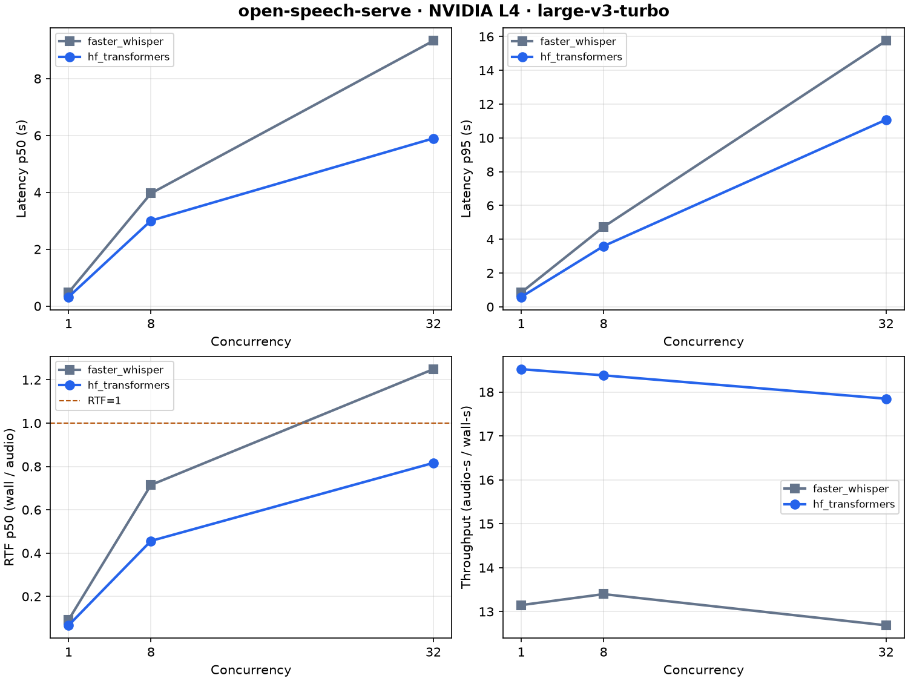
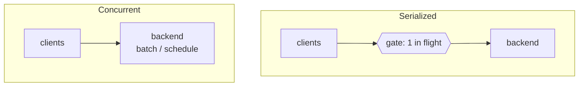

# open-speech-serve

**Whisper serving benchmark** across HF Transformers, faster-whisper, vLLM,
SGLang, and TensorRT-LLM/Triton, plus a **streaming WebSocket TTFS** cell.

Inspired by [whisper-serving-bench](https://github.com/dyl5051/whisper-serving-bench).

|                | whisper-serving-bench | open-speech-serve |
| -------------- | --------------------- | ----------------- |
| Frameworks     | 5                     | 5                 |
| GPUs           | multi-GPU             | 1                 |
| Concurrency    | 1/8/32/64/128         | 1/8/32            |
| Streaming TTFS | no                    | yes               |

## How it fits together



Cell YAMLs under `configs/` pick framework, model, concurrency, and dispatch
mode. Offline cells go through the loadgen; the streaming path is a separate
WebSocket + TTFS measurement.

## Results

On one RTX 6000 Ada with `large-v3-turbo` (FP16), concurrent serving throughput
ranks **TensorRT-LLM > vLLM ≫ SGLang (c1/c8) > HF ≈ faster-whisper**. In-process
baselines stay ~30× realtime; engineered servers reach ~250–310× before
saturating.



SGLang at concurrency 32 is **invalid** (experimental Whisper path; server
timeout / self-kill under load). Full matrix and notes:
[docs/RESULTS.md](docs/RESULTS.md) ·
[results/published/gpu_sweep.md](results/published/gpu_sweep.md).

### Serialized vs concurrent

Both modes use the same concurrent client pool; only the gate differs:



Serialized preserves concurrent arrivals but only one call reaches inference at
a time — e2e latency is mostly queue wait; throughput stays flat. Concurrent
lets the server batch; client queue ≈ 0 and throughput scales until the GPU
saturates. See [docs/METHODOLOGY.md](docs/METHODOLOGY.md).

## Quick start (Docker / CPU)

```bash
make build
make prepare
make mock                                          # plumbing only
make smoke                                         # mock + faster-whisper tiny
```

Streaming server + TTFS:

```bash
make server          # terminal 1 — listens on :8000
make ttfs            # terminal 2
```

Docker workflows use plain `docker` via [`scripts/docker.sh`](scripts/docker.sh).

## GPU runs

Needs Docker and the
[NVIDIA Container Toolkit](https://docs.nvidia.com/datacenter/cloud-native/container-toolkit/latest/install-guide.html).

```bash
git clone https://github.com/m-tari/open-speech-serve.git
cd open-speech-serve
nvidia-smi
make gpu-build
make gpu-prepare                 # LibriSpeech; override with N=50
```

**v1 — in-process baselines**

```bash
make gpu-cell                    # default: configs/cells/fw_turbo_c1.yaml
make gpu-cell CELL=configs/cells/hf_turbo_c8.yaml
make gpu-sweep                   # full 6-cell v1 matrix

# optional streaming
make gpu-server                  # terminal 1
make gpu-ttfs                    # terminal 2
```

**v2 — serving frameworks** (isolated CUDA/Torch envs; 15-cell publication run)

```bash
make v2-comparison
# later: make v2-comparison SKIP_PREP=1 SKIP_TRT_PREP=1
```

Writes `results/v2_comparison/summary.md` and
`results/v2_comparison/published/gpu_sweep.{md,png}`.

Per-backend debug (bring up → run cell → tear down):

```bash
# vLLM
make vllm-up
make vllm-cell CELL=configs/cells/vllm_turbo_c8_concurrent.yaml
make stop-vllm

# SGLang
make sglang-up
make sglang-cell CELL=configs/cells/sglang_turbo_c8_concurrent.yaml
make stop-sglang

# Triton / TensorRT-LLM
make triton-prepare && make triton-up
make triton-cell CELL=configs/cells/trtllm_turbo_c8_concurrent.yaml
make stop-triton
```

Results land in `./results`; data in `./data`. Deployment details:
[docs/DEPLOYMENT.md](docs/DEPLOYMENT.md).

Re-plot committed CUDA cells:

```bash
pip install -e .
plot   # or: make plot → results/published/gpu_sweep.{png,md}
```

### GPU telemetry

```bash
make gpu-telemetry          # standard cells + nvidia-smi during timed passes
make plot-gpu-telemetry     # → util vs concurrency + util vs time (c8)
```

See [docs/METHODOLOGY.md](docs/METHODOLOGY.md).

## Metrics

- **Latency** p50 / p95 / p99 (warmup excluded; median across 3 passes)
- **Service latency / queue wait** split for serialized-vs-concurrent analysis
- **RTF** = wall_s / audio_s (lower is faster)
- **Throughput** = total audio seconds / wall seconds under concurrency
- **WER** (word error rate) when references exist (shared normalizer)
- **TTFS** (time to final speech) for streaming: client `EOS` → server `final` transcript
- **GPU telemetry** (optional): mean/p95 util, peak memory, power during timed passes

## Layout

```
adapters/     # local, OpenAI transcription, and Triton clients
bench/        # manifest, normalize, WER, metrics, loadgen, harness
streaming/    # FastAPI WebSocket server + TTFS client
configs/      # cell YAMLs + sweeps
scripts/      # prepare_data, run_cell, run_sweep, analyze, plot_*
docs/         # methodology, deployment, results writeup
results/published/  # committed plots + summary
results/gpu_telemetry/published/  # util plots
```

## Env knobs

| Variable            | Default                               | Meaning                                      |
| ------------------- | ------------------------------------- | -------------------------------------------- |
| `OSS_FRAMEWORK`     | `faster_whisper`                      | server backend                               |
| `OSS_MODEL`         | `tiny` (CPU) / `large-v3-turbo` (GPU) | Whisper size                                 |
| `OSS_DEVICE`        | `cpu` / `cuda`                        | device                                       |
| `OSS_COMPUTE_TYPE`  | `int8` / `float16`                    | compute type                                 |
| `OSS_GPU_TELEMETRY` | unset                                 | `1` to sample nvidia-smi during timed passes |

## License

MIT.
