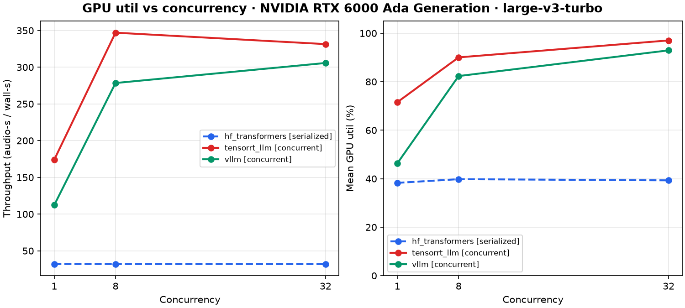
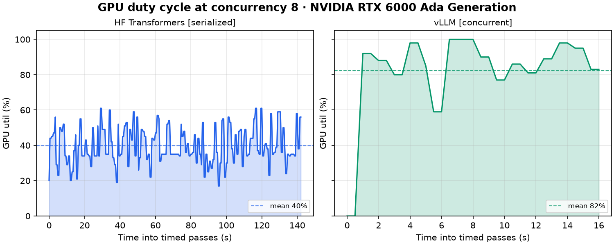

# GPU util vs concurrency

From `*_latest.json` cells with `gpu_telemetry` (nvidia-smi during timed passes).

| cell | framework | mode | conc | throughput | util mean % | util p95 % | mem max MiB | samples |
|---|---|---|---:|---:|---:|---:|---:|---:|
| hf_turbo_c1 | hf_transformers | serialized | 1 | 32.023 | 38.288 | 56.000 | 2490.000 | 285 |
| hf_turbo_c8 | hf_transformers | serialized | 8 | 31.934 | 39.804 | 58.000 | 2604.000 | 285 |
| hf_turbo_c32 | hf_transformers | serialized | 32 | 31.900 | 39.318 | 58.000 | 3100.000 | 286 |
| trtllm_turbo_c1_concurrent | tensorrt_llm | concurrent | 1 | 174.152 | 71.564 | 79.000 | 12018.000 | 55 |
| trtllm_turbo_c8_concurrent | tensorrt_llm | concurrent | 8 | 347.007 | 90.037 | 99.000 | 12050.000 | 27 |
| trtllm_turbo_c32_concurrent | tensorrt_llm | concurrent | 32 | 331.446 | 97.036 | 99.000 | 12066.000 | 28 |
| vllm_turbo_c1_concurrent | vllm | concurrent | 1 | 112.410 | 46.354 | 55.000 | 44544.000 | 82 |
| vllm_turbo_c8_concurrent | vllm | concurrent | 8 | 278.467 | 82.333 | 100.000 | 44544.000 | 33 |
| vllm_turbo_c32_concurrent | vllm | concurrent | 32 | 305.737 | 92.933 | 100.000 | 44544.000 | 30 |

If throughput flattens while mean GPU util is near the ceiling, the plateau is
device saturation rather than client under-load. Here engine util is already
~82–90% mean at c8 (p95 ~100%), while serialized HF stays ~40% mean — see
[docs/RESULTS.md](../../../docs/RESULTS.md).

## GPU duty cycle at concurrency 8

Util vs time from the same CSVs (HF serialized vs vLLM concurrent). N=205 /
passes=3 gives a long enough window for both series.

